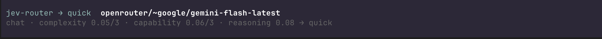

# pi-jev-model-router

A [pi](https://github.com/earendil-works/pi) extension that routes every prompt to
a task-appropriate model using **TypeSafe Jev** (System One) typed judgments.
You type normally; before the turn starts, Jev reads the request and answers five
narrow questions, code composes those into a capability tier plus a thinking
level, applies your budget policy, and pi switches to the matching model.



<p align="center"><em>Every routed prompt shows the model it chose and the judgment behind it.</em></p>

- **Task-aware** — planning goes to reasoners, implementation to coding specialists, chat to cheap fast models.
- **Budget-aware** — daily/monthly caps downgrade tiers automatically instead of overspending.
- **Resilient** — each tier is a candidate chain; if a model is unavailable or unauthenticated, the next one is used.
- **Visible** — the transcript records the chosen model and the exact reason (kind, complexity, capability, reasoning, budget pressure).
- **Fails open** — a missing key, timeout, or unknown model just warns and runs your prompt on the current model.

## How it works

```
you type a prompt
        │
        ▼
   Jev (one request, 5 parallel questions)
     • task_kind            choice: plan / implement / debug / refactor / review / research / explain / operate / write / chat
     • complexity           score:  trivial → architectural
     • capability_deserved  score:  minimal → maximum (price ignored)
     • needs_deep_reasoning noul:   yes/no probability
     • thinking_level       choice: off → max (how deep should this task think)
        │
        ▼
   code composes the decision
     demand = 0.55·complexity + 0.45·capability (+ reasoning nudge)
     demand = max(demand, kind floor)          # planning/review never go cheap
     thinking = pin > Jev judgment > demand ladder > tier default
     confidence guard → budget guard → availability guard → cache guard
        │
        ▼
   pi.setModel(...) + pi.setThinkingLevel(...)  → the turn runs on that model
```

**Jev judges the task, code owns the budget.** Changing your spend caps never
invalidates the judgment, and the judgment stays a pure semantic read of the
request.

## Requirements

- pi (`@earendil-works/pi-coding-agent`)
- Node.js 22.19+ (the same floor pi itself requires)
- A TypeSafe API key with access to `jev-latest` — <https://typesafe.ai>

## Install

### 1. Install pi

```bash
npm install -g --ignore-scripts @earendil-works/pi-coding-agent
```

Verify with `pi --version`. See the
[pi quickstart](https://github.com/earendil-works/pi/blob/main/packages/coding-agent/docs/quickstart.md)
for other installation methods and authentication options.

### 2. Install this package

From this repo's git ref (recommended — the hardened releases live here):

```bash
pi install git:github.com/ckijficqstrvy/pi-jev-router@v0.5.0
```

From a local checkout:

```bash
pi install /absolute/path/to/pi-jev-router
```

Try it once without installing:

```bash
pi -e git:github.com/ckijficqstrvy/pi-jev-router@v0.5.0
```

From npm — beware: `npm:pi-jev-model-router` is the **upstream** package
(da-vinci-noob) and npm still serves its `0.3.0`, which predates the security
hardening described below. This fork is not published to npm.

```bash
pi install npm:pi-jev-model-router   # upstream 0.3.0, pre-hardening
```

Manage it like any other pi package:

```bash
pi list                       # show installed packages
pi update --extensions        # update packages
pi remove npm:pi-jev-model-router
```

### 3. Set your TypeSafe API key

```bash
export TYPESAFE_API_KEY=...
```

Add it to your shell profile to persist it, or run `/typesafe login`:
pi-typesafe then stores the key in `~/.pi/agent/pi-typesafe/auth.json`, which
this router reads as the fallback source. That file must be private
(`chmod 600`, mode `0600`) — the router refuses to read it while group or
other permission bits are set. There is no config key for the API key.

### 4. Use it

Start pi and type a request. Before the turn runs, the router announces the
decision (same text in every mode; `auto` applies the switch first):

```
Jev → standard (openrouter/xiaomi/mimo-v2.6-pro)
plan · complexity 1.70/3 · capability 1.55/3 · reasoning 0.82 → high (used standard) · budget 74% of cap → one tier down
```

The status bar shows e.g. `jev-router:standard · $0.42 · 74% · notify` — active
tier, spend, budget pressure, and the mode whenever it is not `auto` — or
`jev-router:off` when disabled. No configuration is required — sensible
defaults are built in.

## Commands

| Command | What it does |
| --- | --- |
| `/jev-router` | Status: mode, spend, tier chains, kind specialists, last decision |
| `/jev-router on` / `off` | Enable/disable routing |
| `/jev-router mode auto\|confirm\|notify` | `auto` switches silently; `confirm` asks each turn; `notify` only tells you |
| `/jev-router budget daily 10` | Session-only daily cap (persist it in `~/.pi/agent/pi-jev-model-router/config.json`) |
| `/jev-router budget monthly 150` | Session-only monthly cap |
| `/jev-router why` | Re-run Jev on the last prompt and show the full judgment + decision trace |
| `/jev-router revert` | Switch back to the model that was active before the last auto-switch |
| `/jev-route <text>` | Classify arbitrary text and show the recommendation without switching |

The model can also call the `jev_route` tool to ask for a tier recommendation for
a subtask.

`on`/`off`, `mode`, and `budget` changes are session-only: `/reload` or a
restart re-reads `enabled` and `mode` from `config.json` and the
`JEV_ROUTER_*` environment.

### What you see

Every decision is a durable entry in the transcript, so the chosen model and its
justification are always available:

```
jev-router → standard  openrouter/xiaomi/mimo-v2.6-pro
plan · complexity 1.70/3 · capability 1.55/3 · reasoning 0.82 → high (used standard)
· budget 74% of cap → one tier down
```

The glyph encodes the action: `→` switched, `=` already active (stickiness),
`•` notify-only mode, `×` skipped. Expand the entry for the raw judgment: kind
and confidence, complexity, capability deserved, deep-reasoning probability,
composed demand, budget pressure, and the thinking level — resolved, judged,
and the value pi actually applied after per-model clamping. Entries are stored
in the session but never sent to the LLM, so they cost no context.

Prompts that are deliberately not routed are shown too, so behaviour is never
silently missing:

```
jev-router · not routed
acknowledgement — staying on the current model
using openrouter/~anthropic/claude-opus-latest
```

## Which models it uses by default

The defaults target **OpenRouter**, because it exposes a large catalogue through a
single provider id. Four capability tiers, each an ordered fallback chain:

| Tier | Order tried | Tier thinking default* |
| --- | --- | --- |
| `quick` | `~z-ai/glm-flash-latest` → `xiaomi/mimo-v2.6-flash` | `off` |
| `standard` | `xiaomi/mimo-v2.6-pro` | `low` |
| `high` | `openai/gpt-6-astra` → `~anthropic/claude-sonnet-latest` | `medium` |
| `premium` | `~anthropic/claude-opus-latest` | `high` |

\* Fallback rung (last in line — see **Thinking levels** below); by default the
level is judged per task by Jev's fifth question.

Model picks refreshed against the Artificial Analysis intelligence index
(2026-09): `glm-flash` ≈42 and `gpt-6-astra` 46–53 replaced weaker picks at
`quick`/`high` (the old `high` pick scored *below* the `standard` tier's 46),
and the demoted models stay in the chain as fallbacks. `openai/gpt-6-astra` is
pinned as an exact slug rather than `~openai/gpt-astra-latest` on purpose: an
alias jump must not silently change the tier's price class.

Plus kind specialists, tried before the tier chain when the chosen tier is high
enough (`minTier`):

| Kind | Specialists |
| --- | --- |
| `plan` | `~anthropic/claude-opus-latest` (≥premium) → `~anthropic/claude-sonnet-latest` (≥high) |
| `implement` | `xiaomi/mimo-v2.6-pro` (≥standard) → `~anthropic/claude-sonnet-latest` (≥standard) → `openai/gpt-6-astra` (≥high) → `~anthropic/claude-opus-latest` (≥premium) |
| `debug` | `xiaomi/mimo-v2.6-pro` (≥standard) → `openai/gpt-6-astra` (≥high) → `~anthropic/claude-sonnet-latest` (≥high) → `~anthropic/claude-opus-latest` (≥premium) |
| `refactor` | `xiaomi/mimo-v2.6-pro` (≥standard) |
| `review` | `~anthropic/claude-opus-latest` (≥high) → `~anthropic/claude-sonnet-latest` (≥standard) |
| `research` | `~anthropic/claude-sonnet-latest` (≥standard) → `xiaomi/mimo-v2.6-pro` (≥standard) |
| `explain` | `xiaomi/mimo-v2.6-flash` (≥quick) → `xiaomi/mimo-v2.6-pro` (≥standard) |
| `operate` | `xiaomi/mimo-v2.6-pro` (≥standard) |
| `chat` | `xiaomi/mimo-v2.6-flash` (≥quick) |
| `write` | `~anthropic/claude-sonnet-latest` (≥standard) → `xiaomi/mimo-v2.6-pro` (≥standard) |

Provider-maintained `~...-latest` aliases are used wherever they exist, so the
chains follow new model releases instead of going stale.

**Maintenance note:** `xiaomi/mimo-v2.6-*` are fixed slugs with no `~latest`
alias. When upstream retires them, routing leans on the adjacent-tier fallback
in `decide()`; re-check with `pi --list-models` once per maintenance cycle and
refresh the slugs if they are gone.

Run `/jev-router` to see this for your own setup, with a `✓`/`✗` per route
showing what is actually available and authenticated.

## Thinking levels: judged per task, pinnable per route

Jev's fifth question (`thinking_level`, a `choice` from `off` to `max`) judges
how much extended pre-answer thinking the *task* deserves — the model and its
price are excluded from the rubric. The level is resolved per prompt, first hit
wins:

1. **Config pin** — `thinkingLevel` written on a route entry in `config.json`:
   explicit user intent beats everything.
   *Where to pin matters:* with the default `kindModels` covering every kind,
   a **switched** decision's target usually comes from the kind chain, not the
   tier chain — so pin `thinkingLevel` on the `kindModels` entry you actually
   route to. `routes` pins still govern kept/held decisions (their target is
   looked up from `routes` first) and config-only setups without kind chains.
   Verified end-to-end: a pin on `kindModels.refactor[0]` beat Jev's `minimal`
   judgment, and a pin of `max` on the flash entry clamped to `high` on
   readback.
2. **Jev judgment** — the fifth question's answer.
3. **Demand ladder** — pure-code fallback when the fifth answer is missing or
   invalid: `demand < 0.5 → off`, `< 1.5 → low`, `< 2.5 → medium`, `< 2.9 →
   high`, else `xhigh` (demand pinned at the top = architectural + deep
   reasoning).
4. **Tier default** — `TIER_THINKING` (`quick: off`, `standard: low`,
   `high: medium`, `premium: high`), i.e. exactly what the router used before
   the fifth question existed.

Every layer is optional and each fallback is backward-compatible, so routing
never behaves worse than the old static table — a missing fifth answer just
lands one layer down. The resolved level is applied whenever the router **keeps,
holds, or switches to** a model. The kept/held paths used to skip it entirely,
which left thinking stale after a manual model switch or a cache hold; that is
fixed.

`pi.setThinkingLevel` clamps to the model's capabilities, so the entry records
what pi **actually applied** (read back via `getThinkingLevel`) beside the
resolved and raw-judged values:

```
thinking medium (jev) → applied low (clamped by model)     ← expanded entry
thinking high (pin, judged medium) → applied high
```

In `notify` mode a *suggested switch* still mutates nothing: the notification
shows the resolved level annotated `not applied (notify mode)`. When the
decision keeps or holds the current model, the level is applied in every mode —
that is the stale-thinking fix, not a model switch.

## Extending to more models and providers

The router is provider-agnostic: it only references models that pi already knows
about, so **if pi can use a model, the router can route to it.** You are never
limited to OpenRouter — the defaults are just a convenient starting point.

### 0. Drop the built-in models entirely (optional)

By default your config is *merged over* the built-in chains, so a tier you don't
mention keeps its defaults. If you'd rather start from nothing and use only your
own models, set:

```json
{
  "useDefaultModels": false,
  "routes": {
    "quick": [{ "provider": "openrouter", "model": "~z-ai/glm-flash-latest" }],
    "high":  [{ "provider": "anthropic", "model": "claude-sonnet-4-5" }]
  },
  "kindModels": {
    "implement": [{ "provider": "openrouter", "model": "moonshotai/kimi-k2.7-code", "minTier": "standard" }]
  }
}
```

With `useDefaultModels: false`:

- the built-in `routes` and `kindModels` are **gone** — not available as a base
  or as fallback;
- tiers or kinds you don't configure are **empty**, and the router simply skips
  them (it never invents a model);
- everything that isn't a model list still applies — timeouts, `budget`,
  `cache`, and the `kindMinimumTier` floors.

`/jev-router` prints `built-in models: off (config-only)` and marks empty tiers
as `(none configured)`. If a tier you need is empty, pi warns on session start.

### 1. Find the model ids pi knows

```bash
pi --list-models                 # all providers
pi --list-models | grep anthropic
pi --list-models | grep -E 'gpt-5|codex'
```

The first column is the **provider id** and the second is the **model id**. Those
are exactly the two fields the config uses.

> Providers not yet configured can be added with `/login` inside pi, an API key
> environment variable, or a custom provider registered by another extension —
> including local servers such as Ollama or llama.cpp. See the
> [providers docs](https://github.com/earendil-works/pi/blob/main/packages/coding-agent/docs/providers.md).

### 2. Point the tiers at your models

Create `~/.pi/agent/pi-jev-model-router/config.json` (the only config file —
project-level configs are not read). Anything you set is merged over the
defaults, per tier.

```json
{
  "routes": {
    "quick": [
      { "provider": "openrouter", "model": "~google/gemini-flash-latest" }
    ],
    "standard": [
      { "provider": "anthropic", "model": "claude-haiku-4-5" }
    ],
    "high": [
      { "provider": "anthropic", "model": "claude-sonnet-4-5" },
      { "provider": "openai", "model": "gpt-5.4" }
    ],
    "premium": [
      { "provider": "anthropic", "model": "claude-opus-4-5" },
      { "provider": "openai", "model": "gpt-5.5-pro" }
    ]
  }
}
```

Each tier is a **candidate chain**, tried top to bottom. The first model that
exists in pi's catalogue *and* is authenticated wins; if none are usable the
router steps to the nearest tier instead of failing. Add `"thinkingLevel"` to any
entry to pin it (`"off" | "minimal" | "low" | "medium" | "high" | "xhigh" | "max"`;
pi clamps it per model). A pin beats Jev's per-task thinking judgment — the full
precedence chain is under **Thinking levels** above.

Mixing providers is fine — put an OpenRouter model and a direct-Anthropic model in
the same chain.

### 3. Add or change task specialists

```json
{
  "kindModels": {
    "implement": [
      { "provider": "openrouter", "model": "openai/gpt-5.3-codex", "minTier": "standard" },
      { "provider": "anthropic", "model": "claude-sonnet-4-5", "minTier": "standard" }
    ],
    "plan": [
      { "provider": "openai", "model": "gpt-5.5", "minTier": "high" },
      { "provider": "anthropic", "model": "claude-opus-4-5", "minTier": "premium" }
    ]
  }
}
```

`minTier` gates a model to a minimum capability tier, so a specialist is only
used when the judgment justifies it. Among eligible specialists, the one whose
`minTier` is closest to the chosen tier wins — a cheap specialist never wins a
premium-quality turn.

### 4. Set the floor per task kind

```json
{
  "kindMinimumTier": {
    "plan": "high",
    "review": "high",
    "implement": "standard",
    "debug": "standard",
    "chat": "quick"
  }
}
```

Known kinds: `plan`, `implement`, `debug`, `refactor`, `review`, `research`,
`explain`, `operate`, `write`, `chat`.

### 5. Change which task kinds exist

The kinds are defined in `extensions/pi-jev-model-router/config.ts`
(`TASK_KINDS`) and passed to Jev as the choice criteria. Edit the labels, add
domains of your own (for example `data`, `infra`, `legal`), then add matching
entries under `kindModels` and `kindMinimumTier`. Because the question is a Jev
`choice`, the option set *is* the taxonomy — no retraining, no prompt parsing.

### Config resolution order

Later sources win:

1. built-in defaults
2. `~/.pi/agent/pi-jev-model-router/config.json`
3. `JEV_ROUTER_*` environment variables (table below)

| Variable | Overrides | Accepts |
| --- | --- | --- |
| `JEV_ROUTER_ENABLED` | `enabled` | `1/0`, `true/false`, `yes/no`, `on/off` |
| `JEV_ROUTER_OFF` | `enabled` (legacy kill switch) | `1`/`true` disables routing; `JEV_ROUTER_ENABLED` wins when both are set |
| `JEV_ROUTER_MODE` | `mode` | `auto`, `confirm`, `notify` |
| `JEV_ROUTER_USE_DEFAULT_MODELS` | `useDefaultModels` | boolean |
| `JEV_ROUTER_JEV_MODEL` | `jevModel` | printable ASCII model id |
| `JEV_ROUTER_TIMEOUT_MS` | `timeoutMs` | integer ≥ 0 |
| `JEV_ROUTER_MIN_PROMPT_CHARS` | `minPromptChars` | integer ≥ 0 |
| `JEV_ROUTER_HISTORY_TURNS` | `historyTurns` | integer ≥ 0 |
| `JEV_ROUTER_CONFIDENCE_THRESHOLD` | `confidenceThreshold` | number 0–1 |
| `JEV_ROUTER_STICKINESS` | `stickiness` | boolean |
| `JEV_ROUTER_BUDGET_DAILY_USD` | `budget.dailyUsd` | USD amount ≥ 0, or `none` to remove the cap |
| `JEV_ROUTER_BUDGET_MONTHLY_USD` | `budget.monthlyUsd` | USD amount ≥ 0, or `none` to remove the cap |
| `JEV_ROUTER_BUDGET_SOFT_RATIO` | `budget.softRatio` | number 0–1, ≤ `budget.hardRatio` |
| `JEV_ROUTER_BUDGET_HARD_RATIO` | `budget.hardRatio` | number 0–1, ≥ `budget.softRatio` |
| `JEV_ROUTER_CACHE_AWARE` | `cache.aware` | boolean |
| `JEV_ROUTER_CACHE_DEADBAND` | `cache.deadband` | number ≥ 0 |
| `JEV_ROUTER_CACHE_MAX_PENALTY_USD` | `cache.maxPenaltyUsd` | USD amount ≥ 0 |
| `JEV_ROUTER_CACHE_BYPASS_TIER_DELTA` | `cache.bypassTierDelta` | integer ≥ 0 |
| `JEV_ROUTER_KIND_MIN_TIER` | `kindMinimumTier` entries | comma-separated `kind=tier` pairs, e.g. `plan=high,review=high` |

`routes` and `kindModels` are lists of model specs — structured data belongs in
config.json, so they are deliberately not environment-reachable.
`TYPESAFE_API_KEY` is read for authentication, not as a config override.

Every value is validated when the config loads. A malformed or out-of-range
value never reaches the router: the variable is dropped with a warning, the
config.json/default value stands, and the problem is reported at session start
and in `/jev-router` status (the offending value is echoed only when it is
short printable ASCII). An empty value counts as unset.

There is no project-level config: a cloned repo cannot inject router settings.

A full example lives at
[`extensions/pi-jev-model-router/pi-jev-model-router.example.json`](extensions/pi-jev-model-router/pi-jev-model-router.example.json).
Run `/reload` after editing config.

## Budget management

Cost is accumulated from each assistant message's computed cost into
`~/.pi/agent/pi-jev-model-router/state.json`, together with Jev request counts.

```
pressure = max(today ÷ dailyUsd, month ÷ monthlyUsd)
```

- `pressure ≥ softRatio` (default `0.7`) → drop one tier
- `pressure ≥ hardRatio` (default `0.9`) → force `quick`, unless the demand score
  is ≥ 2.5 (clearly architectural), which may stay at `standard`

```json
{
  "budget": {
    "dailyUsd": 5,
    "monthlyUsd": 100,
    "softRatio": 0.7,
    "hardRatio": 0.9
  }
}
```

The defaults are `$5/day` and `$100/month`. Set a cap to `0` to explicitly
disable that dimension (omitting it keeps the default). Caps are policy, not a
hard stop — they redirect routing, they do not block turns.

## Prompt-cache awareness

Switching models discards the provider's prompt cache, and caches are per-model.
The next request then re-reads the entire prefix — system prompt, tool schemas,
and conversation — at the new model's full input rate. Cache reads are ~10% of
input on the major providers, so a switch effectively costs the whole context
once, and a switch back costs it again. Priced at Sonnet-class rates
(~$3/M input, ~$3.75/M cache write, ~$0.30/M cache read per million tokens),
one switch re-reads a 50k context for roughly $0.32 and a 200k context for
roughly $1.29.

The router therefore gates switches instead of making them freely:

- **Cache penalty cap** — estimates the miss (`contextTokens × (new model's
  input + cache-write rate − current model's cache-read rate)`) and refuses
  the switch when it exceeds `maxPenaltyUsd`.
- **Dead-band** — demand has to clear the current tier's band (`tier ± 0.5`) by
  `deadband` before a tier change is considered, so prompts hovering on a
  boundary stop flapping between two models.
- **Big-jump bypass** — a tier jump of `bypassTierDelta` or more still switches,
  because that is a genuine capability change rather than a marginal one.
- **Same-tier swaps count too** — a specialist swap such as Sonnet → Codex at the
  same tier is still a model change, and is priced the same way.

Held turns still record the decision, and say so:

```
jev-router = high  openrouter/~anthropic/claude-sonnet-latest
explain · complexity 0.60/3 · capability 0.50/3 · reasoning 0.30 → standard, held on high to keep the cache
· cache penalty ~$0.186 on 120k tokens — keeping the warm cache
```

The estimate is a lower bound — real cacheable prefixes include the system prompt
and tool schemas, which `contextTokens` does not count — and it is skipped
entirely when a model's pricing is unknown, so it never blocks on guesses. Set
`cache.aware: false` to restore unconditional switching.

```json
{
  "cache": {
    "aware": true,
    "deadband": 0.25,
    "maxPenaltyUsd": 0.05,
    "bypassTierDelta": 2
  }
}
```

## Security model

- **Fixed endpoint** — the Jev URL is hardcoded (`https://api.typesafe.ai/v1/systemone`);
  there is no `endpoint` config key, so a config file cannot redirect the
  Bearer key or the payload.
- **Two key sources, env first** — `TYPESAFE_API_KEY` from the environment,
  then pi-typesafe's stored key at `~/.pi/agent/pi-typesafe/auth.json` (must be
  mode `0600`). There is no `apiKey`/`apiKeyEnv` config key, and no output ever
  prints a key value.
- **Fixed ledger path** — spend persists only to
  `~/.pi/agent/pi-jev-model-router/state.json`; `stateFile` is not configurable.
- **Minimal payload** — Jev receives `{ request, conversation_excerpt }` only.
  The excerpt is off by default (`historyTurns: 0`) and capped at 4000
  characters when enabled; cwd, environment, and spend numbers are never sent.
- **Config whitelist** — `merge()` copies only the keys the interface declares;
  unknown keys in the config file are dropped, so removed keys cannot come back.

**Migrating from 0.3.0:** if you wrote `apiKey` into a config file, switch to
`TYPESAFE_API_KEY` or `/typesafe login`; if you used a project-level
`<cwd>/.pi/pi-jev-model-router.json`, move its contents to
`~/.pi/agent/pi-jev-model-router/config.json` (project files are no longer read); the
new `$5/day` / `$100/month` budget defaults now apply unless you set your own.

## Configuration reference

| Key | Default | Purpose |
| --- | --- | --- |
| `enabled` | `true` | Master switch |
| `useDefaultModels` | `true` | `false` drops the built-in model chains so only your config's models are used |
| `mode` | `"notify"` | `auto` \| `confirm` \| `notify` |
| `jevModel` | `"jev-latest"` | Jev model alias |
| `timeoutMs` | `3500` | Overall Jev time budget: one timeout shared by up to 3 attempts (429/529 and network errors are retried inside it) |
| `minPromptChars` | `12` | Below this, a prompt counts as a continuation (a short *first* message is still routed) |
| `historyTurns` | `0` | Conversation turns included as Jev state (`0` sends none) |
| `confidenceThreshold` | `0.34` | Below this, fall back to `standard` instead of spending premium |
| `stickiness` | `true` | Keep the current model when it is already the chosen one |
| `routes` | see above | Capability tier candidate chains (an entry's `thinkingLevel` pins the thinking level) |
| `kindModels` | see above | Task-specialist chains with `minTier` |
| `kindMinimumTier` | see above | Per-kind floor tier |
| `budget` | `$5/day`, `$100/month` | Spend policy (`0` disables a cap) |
| `cache` | `aware`, cap `$0.05`, deadband `0.25` | Prompt-cache-aware switching |

## Failure behaviour

Routing never blocks your turn. A missing key, network error, timeout (a
3.5 s overall budget shared by up to three attempts — 429/529 and transient
network errors are retried within it), or unknown model means: warn in the
status line and run the prompt on the current model unchanged. Prompts
starting with `/`, pure acknowledgements (`yes`, `continue`, …), image-only
messages, and messages sent by other extensions are never routed.

## Publishing to pi.dev/packages

The [pi package gallery](https://pi.dev/packages) is built from **npm**: it lists
packages that are tagged with the `pi-package` keyword. There is no separate
submission form — publishing to npm *is* the submission.

> This fork is distributed from its own GitHub repo (see **Install**), not
> from npm. The steps below are the path to a gallery release if you ever
> want one.

This repository is already prepared for it:

- `package.json` contains `"keywords": ["pi-package", ...]`
- `package.json` contains a `pi` manifest pointing at the extension entry point
- `package.json` contains `pi.image`, which the gallery uses as the preview card

To publish:

```bash
# 1. Log in to npm (once)
npm login

# 2. Sanity-check what will be shipped
npm pack --dry-run

# 3. Publish
npm publish --access public
```

Then:

1. The gallery indexes it on its next crawl (usually minutes; allow a few hours).
2. Check the listing at `https://pi.dev/packages/<your-package-name>`.
3. Anyone can then install it with `pi install npm:pi-jev-model-router`.

**Releases:** bump `version` in `package.json`, commit, tag, and re-run
`npm publish`. Keep the `image` URL pointed at a released tag or `main` so it
never 404s.

**The name is taken** — `pi-jev-model-router` on npm belongs to upstream — so
publish under a scope (`@yourname/pi-jev-model-router`); the gallery indexes
scoped packages too, and they install with
`pi install npm:@yourname/pi-jev-model-router`.

**Git-only distribution** also works (`pi install git:github.com/user/repo@v1`),
but only npm packages appear in the gallery.

You can also add a GIF or MP4 demo via `pi.video` (MP4 only, takes precedence
over `image`).

## Development

```bash
git clone https://github.com/ckijficqstrvy/pi-jev-router
cd pi-jev-router

# load the package into a throwaway pi run (ignores auto-discovered extensions)
pi -ne -e "$PWD" -p "Explain what an idempotency key does."

# or copy into the auto-discovered location for hot reload
# (mkdir first: without the directory, cp would flatten the files into
#  ~/.pi/agent/extensions/*.ts and pi would try to load every .ts as an extension)
mkdir -p ~/.pi/agent/extensions
cp -R extensions/pi-jev-model-router ~/.pi/agent/extensions/
```

Layout:

| File | Role |
| --- | --- |
| `extensions/pi-jev-model-router/index.ts` | pi wiring: events, commands, `jev_route` tool, model switching, transcript entries |
| `extensions/pi-jev-model-router/config.ts` | config types, defaults, layered loading, task taxonomy |
| `extensions/pi-jev-model-router/jev.ts` | TypeSafe HTTP client, question definitions, response parsing |
| `extensions/pi-jev-model-router/router.ts` | composition (`decide`), tier/kind chains, availability fallback |
| `extensions/pi-jev-model-router/budget.ts` | spend ledger, caps, pressure |

No runtime dependencies: the extension talks to TypeSafe with plain `fetch`. It
imports `typebox` (tool schema) and `@earendil-works/pi-coding-agent` (config
directory path), and loads `@earendil-works/pi-tui` **lazily**, only when the host
implements `registerEntryRenderer`. `@earendil-works/pi-tui` is declared as an
**optional** peer dependency, so hosts that don't ship it still install and run.

## Compatibility with pi builds and forks

`ExtensionAPI` surfaces differ across pi versions and downstream forks (for
example `omp`). The extension probes the host at load time and degrades instead
of failing installation:

| Capability | If the host lacks it |
| --- | --- |
| `registerEntryRenderer` or `@earendil-works/pi-tui` | No transcript card; decisions still show in the status bar and notifications |
| `appendEntry` | Decisions are not persisted as session entries |
| `ctx.ui.notify` / `ctx.ui.setStatus` | Silently skipped |
| `ctx.ui.select` | `confirm` mode falls back to auto-switching |
| `ctx.modelRegistry.find` / `getAvailable` | Reports "model not available in this build" and leaves the current model in place |
| `registerCommand` / `registerTool` | Commands and the tool are not registered; event-driven routing still works |

Nothing in the extension throws during load if an optional API is missing, so
`pi install`, `omp install`, or any plugin validator will accept it.

## License

MIT